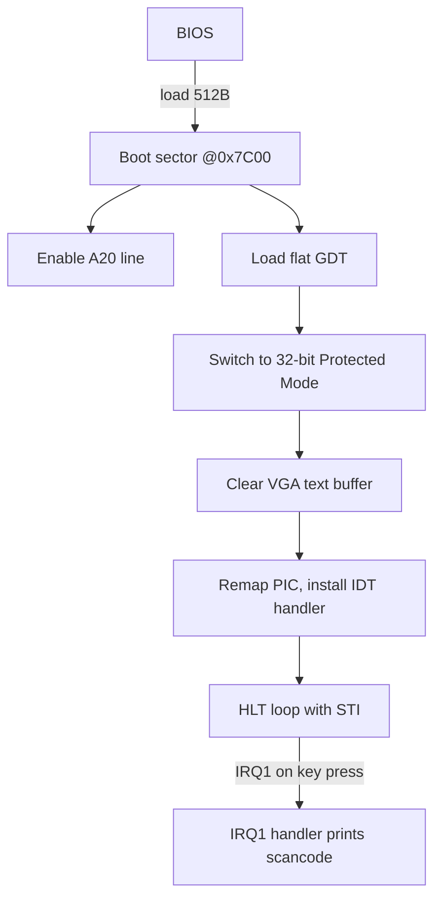
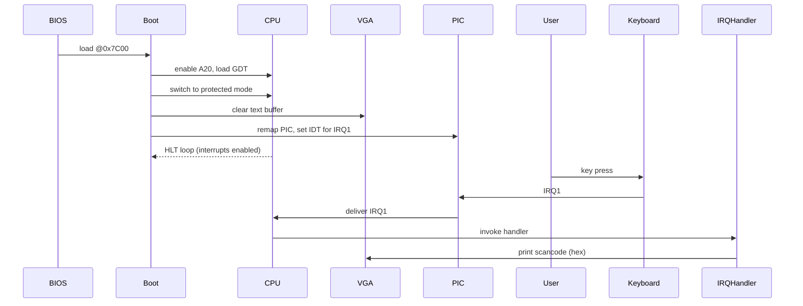

<div align="center">

| **Side Project Notice** |
| :--- |
| This is a personal, passion project with no current plans for a major feature release. However, I intend to occasionally update it, improve the code, and roll out new releases over time. |

</div>


<p align="center">
   
</p>


<h2 align="center">
Orinal – tiny bootable kernel (for learning and experimentation)
</h2>

---

Orinal is a minimalist x86 boot sector (small and self-contained) for learning how early boot and interrupt handling work. It sets up a flat 32-bit protected mode, prints to VGA text memory, and logs keyboard scancodes via IRQ1.

## Quick start (host tools installed)
1. Install `nasm` and `qemu-system-x86_64` on your host.
2. Build: `make`
3. Run (headless, serial to your terminal): `make run`

## Using Docker (no host toolchain needed)
1. Build the image:
```bash
docker build -t orinal .
```
2. Run build & boot via QEMU inside the container (mounts your workspace):
```bash
docker run --rm -it -v "$PWD":/orinal -w /orinal orinal make run
```

Notes:
- Local folder is `karnal`; inside the container we work in `/orinal` to match the image name.
- The QEMU run uses a 10MB raw disk image and IDE boot; if you see hangs, check the troubleshooting section.

## Files
- `src/boot.asm` – 512-byte boot sector: switches to 32-bit protected mode, sets up a flat GDT, clears the VGA text screen, installs an IDT handler for IRQ1 (keyboard), and logs scancodes to VGA.
- `Makefile` – builds `build/boot.bin`, pads `build/disk.img` (10MB), and runs QEMU.
- `Dockerfile` – minimal environment (nasm + qemu) to build/run.
- `assets/logo.svg` – theme-aware logo (light/dark via `prefers-color-scheme`).

## How it works (overview)
- BIOS loads the 512-byte boot sector to `0x7C00`.
- The boot code enables A20, loads a flat GDT, and switches the CPU to 32-bit protected mode.
- VGA text buffer is cleared and used for simple text output (memory at `0xB8000`).
- The PIC is remapped, an IDT entry for IRQ1 (keyboard) is installed, and interrupts are enabled.
- The main code enters a `HLT` loop; on key press IRQ1 runs the handler which prints scancodes in hex to VGA.

### Execution flow (high-level)





### Memory view (text buffer)
- VGA text base: `0xB8000`. Offset = `(row*80 + col) * 2`.
- Each cell is two bytes: `[char][attr]`.

## Next ideas
- Add proper scrolling and restore serial output.
- Add a second-stage loader and switch to 64-bit long mode (C or Rust).
- Translate PS/2 scancodes to ASCII and implement a simple shell input buffer.
- Add a tiny heap/allocator and a basic task loop.

## Troubleshooting
- If QEMU cannot lock the image: kill stray qemu processes (`sudo pkill -f qemu-system-x86_64`) and rerun `make run` inside Docker.
- If BIOS hangs after "Booting from Floppy/Hard Disk": try hard-disk boot with `make run`. For debugging, run QEMU with `-d int,cpu_reset` to get more reset/triple-fault info.

# License

This project is licensed under the MIT License — see the [LICENSE](LICENSE) file for details.

